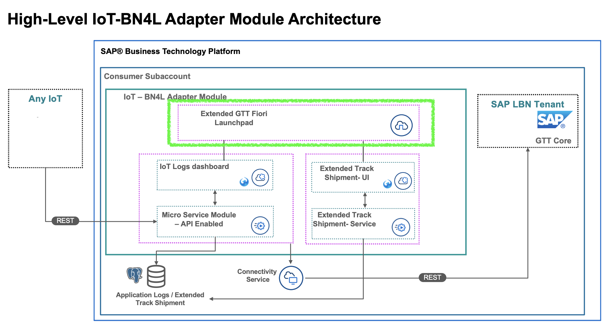
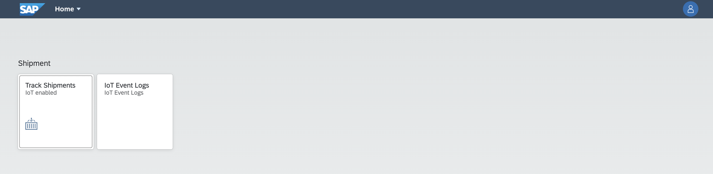

# GTT-V2-Extended-FLP

The FLP project includes 2 applications, Track Shipments extended application and an IOT Logs application. The Track Shipment application is extended using the standard template code delivered by GTT.
Before you build and deploy this, please deploy all the UI projects you need in advance, otherwise the deployment will fail.



## How to deploy

```sh
cf login -a {API Endpoint} -u {Email address} --sso
```
Login to the Cloud Foundry environment on BTP. Open the link {API Endpoint/password} and get passcode.

```sh
cd GTT-V2-Extended-FLP
mbt build
```
This will build the application and generate a deployable *.mtar file.

```sh
cf deploy mta_archives/lbn-gtt-iot-app-flp_2.3.0.mtar
```
This will deploy the FLP to the platform. Once successful, you can find the FLP approuter URL using ```cf a```, look for application named *lbn-gtt-iot-app-appRouter*. Launch the URL in a browser.

## Result


