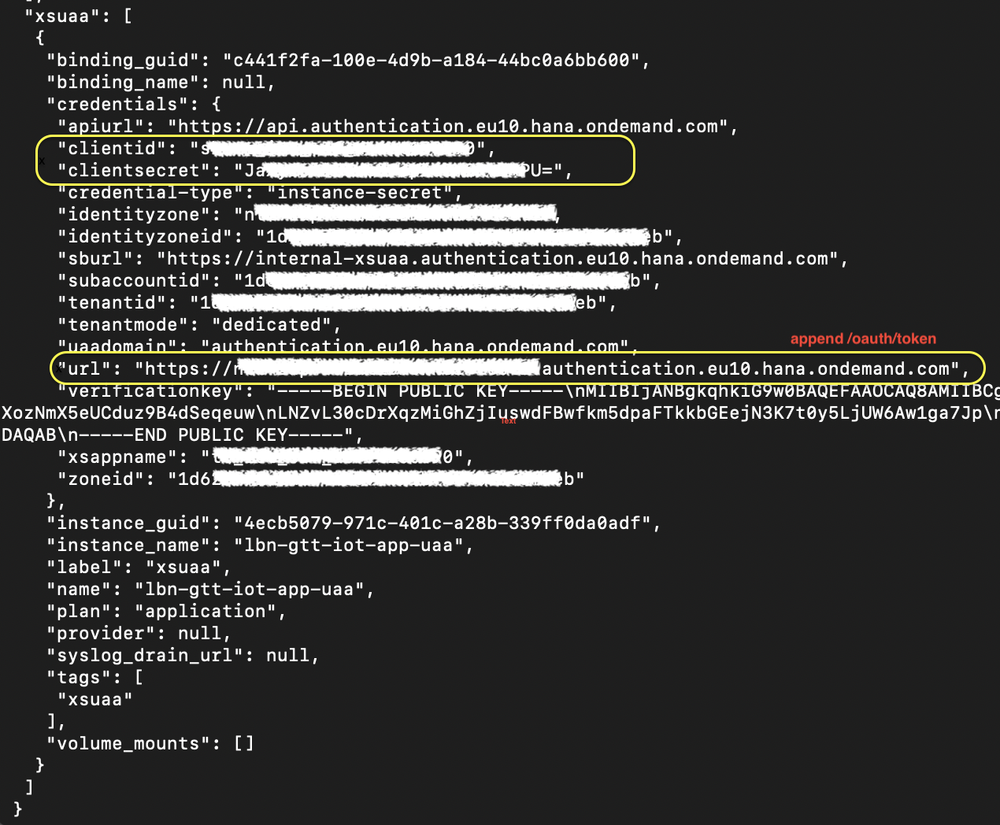

# GTT-V2-ShipmentIotLogs-Service

This application exposes the event endpoint to pass IoT event payload and also serves as a log application to trace the message processing through to BN4L.
The application is based on the Express Node.js web application framework using Typescript. It is deployed on an SAP BTP Cloud Foundry environment and uses PostgreSQL as a database.


### How to deploy
#### Create Services
In SAP BTP Cockpit, create instances of required services: UAA, Destination Service, PostgreSQL.


#### Configure Destination
Create LBN destination in the Destination Service. Define the destination's name in `event.controller.ts`
#### Install packages
Run `npm install` to install required application packages.
#### Deploy to Cloud Foundry
Login to your subaccount's Cloud Foundry dev space via cf cli.
Run `npm run-script build` followed by `cf push` to deploy to subaccount.
#### Bind Services
Bind created services to IoT-logs application either via cf cli or on SAP BTP Cockpit.
#### Configure Database
For PostgreSQL, SSH into instance from using Cloud Foundry CLI and psql.
`cf enable-ssh IoT-LBN-microservice`
`cf ssh -L 63306:"Hostname":"Port" IoT-LBN-microservice`
`psql -d "Database" -U "User" -p 63306 -h localhost`

Then, run CREATE scripts for required tables.

``` sql
CREATE TABLE IF NOT EXISTS public.events_log(shipment_no character varying(100),reported_at character varying(30),timezone character varying(50),reported_by character varying(30),priority smallint,event_body json,lbn_payload json,lbn_status character varying(30),updated_at timestamp with time zone,CONSTRAINT events_log_pkey PRIMARY KEY (shipment_no, reported_at));
```
``` sql
CREATE TABLE IF NOT EXISTS public.lbn_response(shipment_no character varying(100),reported_at timestamp with time zone,response_at timestamp with time zone,error_body character varying(100),status character varying(30),CONSTRAINT lbn_response_pkey PRIMARY KEY (shipment_no, reported_at));
```
### Event API specification

#### Host URL and path
The host or application url can be found by accessing the application ```IoT-LBN-microservice``` using the command ```cf a ``` in the BTP environment.
Append the path `/api/v1/iot/shipment/events` and use the method POST to call the API with the payload defined below.

#### Payload specification

| Field | Description |
| --- | --- |
| shipmentNo | Shipment no to track. This has to be BN4L-GTT understandable shipment no |
| reportedAt | Time at which the event is reported to GTT |
| timezone | Timezone of reporting entity/system |
| priority | Priority that identifies criticality of the event |
| reportedBy | reporter's identification. Could be system ID or if manual readings taken, the ID/name of the person |
| eventDetails | This section captures the IOT event details |
| eventDetails-Key | Parameter that has exceeded threshold |
| eventDetails-Value | Value of the parameter |
| eventDetails-Timestamp | Timestamp of the reading |

#### Payload Structure
- The following example payload is logged in the PostgreSQL database instance.
- `shipmentNo` and `reportedAt` are required fields.
``` json
{
    "shipmentNo":"9678292607",
    "reportedAt":"2022-12-06T18:06:12.075Z",
    "timezone": "Australia/Brisbane",
    "priority": 3,
    "reportedBy":"MO001",
    "eventDetails": [
        {
            "Key":"Temperature",
            "Value":"500",
            "Timestamp":"2022-12-06T18:06:12.075Z"
        },
        {
            "Key":"Vibration",
            "Value":"300",
            "Timestamp":"2022-12-06T18:06:12.075Z"
        }
      ]
}
```
#### Authentication for API call
The application uses Oauth 2.0 Bearer Tokens to authenticate API calls. The token is verified against the bound UAA service instance using the `passport` `@sap/xsenv` and `@sap/xssec` packages on a JWT strategy.

In order to get a token to make the API call: 
1. Fetch the environment variables of the microservice using `cf env IoT-LBN-microservice` or from the application overview on SAP BTP Cockpit.
2. Extract the token authentication URL, client ID and client secret as shown below.
3. Append `/oauth/token?grant_type=client_credentials&response_type=token` to the authentication URL.
4. Add the URL and client credentials as Oauth 2.0 Bearer authentication on http requests to the API.



### Test
Using Postman, send a http request to the following endpoints:
- `"application-url"/api/v1/iot/shipment/events` POST - Send an event payload to the microservice
- `"application-url"/api/v1/iot/shipment/events` GET - returns a list of events logged by the microservice
- `"application-url"/api/v1/iot/shipment/:shipmentNo/events/:reportedAt` GET - returns event log by id
- `"application-url"/api/v1/iot/shipment/:shipmentNo/events/:reportedAt/processFlow` GET - returns process flow details by id
