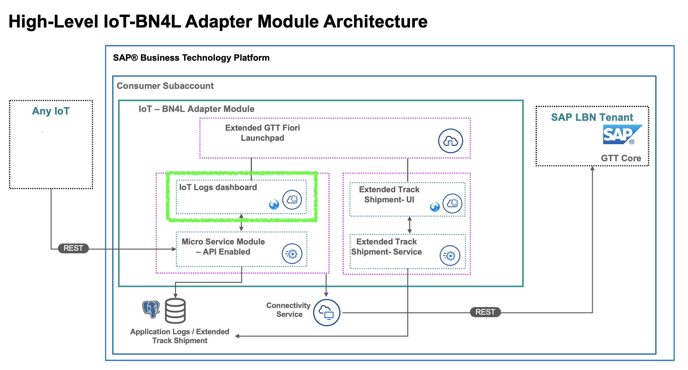
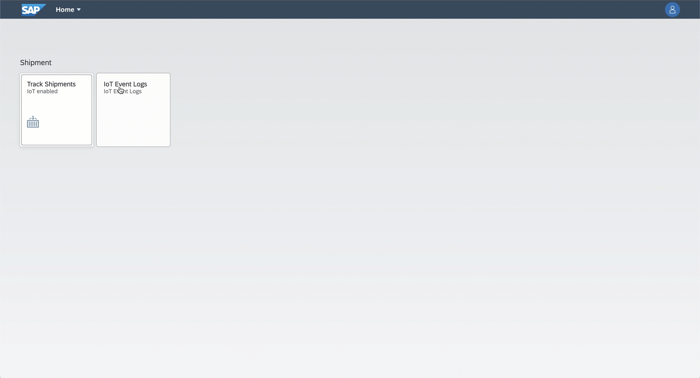

# GTT-V2-ShipmentIotLogs-UI

This is the UI application for IOT Logs, based on SAPUI5 and Fiori. Deploy this before deploying FLP.



## How to deploy

```sh
cf login -a {API Endponit} -u {Email address} --sso
```
Login to the Cloud Foundry environment on BTP. Open the link {API Endpoint/password} and get passcode.

```sh
cd GTT-V2-ShipmentIotLogs-UI
mbt build
```
This will build the application and generate a deployable *.mtar file.

```sh
cf deploy mta_archives/Event-logs_0.0.1.mtar
```
This will deploy the application to the platform. You will still need to deploy the FLP to launch the application.

## How to use


