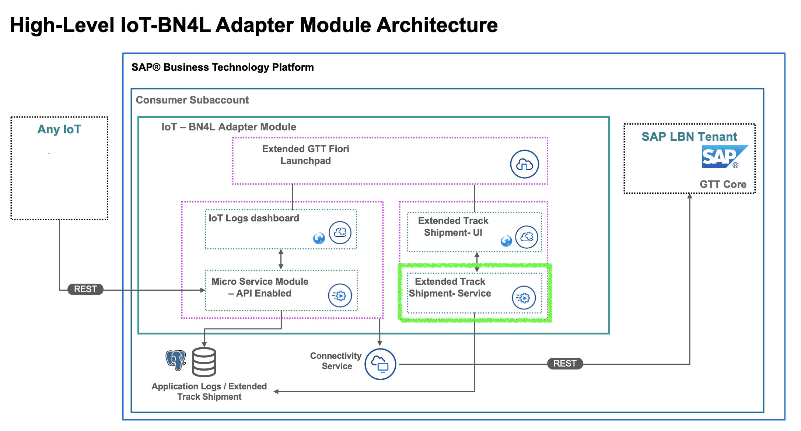

# GTT-V2-TrackShipmentExtended-Service

This application provides CRUD services to manage extended fields. It enables extending Track shipment application with custom fields.
The application is based on TODO (provide technology)



### How to deploy
#### Create Services
In subaccount, create instances of required services: UAA and PostgreSQL.

#### Install packages
Run `npm install` to install required application packages.
#### Deploy to Cloud Foundry
Login to subaccount via cf cli.
Run `npm run-script build` followed by `cf push` to deploy to subaccount.
#### Bind Services
Bind created services to track-shipment-extended application either via cf cli or on subaccount.

#### Configure Database
For PostgreSQL, SSH into instance from using Cloud Foundry CLI and psql.
`cf ssh -L 63306:"Hostname":"Port" "App-Name"`
`psql -d "Database" -U "User" -p 63306 -h localhost`

Then, run create script for required table.

``` sql
CREATE TABLE IF NOT EXISTS public.custom_fields(shipment_no character varying(100) NOT NULL,iot_device_identifier character varying(50),name_of_goods character varying(50),export_company character varying(50),customer_code character varying(50),smart_shipment_id character varying(50),value_of_goods character varying(50),import_company character varying(50),customer_address character varying(50),shipping_company character varying(50),value_of_goods_currency character varying(50),customer_profile character varying(50),customer_id character varying(50),CONSTRAINT custom_fields_pkey PRIMARY KEY (shipment_no));
```
The above fields are only exemplary. If you wish you can replace these or add new fields as required.

### API payload definition.
TODO

### Test
Using Postman, send a http request to the following endpoints:
- `"application-url"/api/v1/iot/shipment/customFields` POST - Send a payload to the application that defines the required custom fields
- `"application-url"/api/v1/iot/shipment/:shipmentNo/customFields` GET - returns the custom fields and their values for shipment id
- `"application-url"/api/v1/iot/shipment/:shipmentNo/customFields` PUT - updates the custom fields and their values for shipment id
- `"application-url"/api/v1/iot/shipment/:shipmentNo/customFields` DELETE - deletes the custom fields and their values for shipment id
