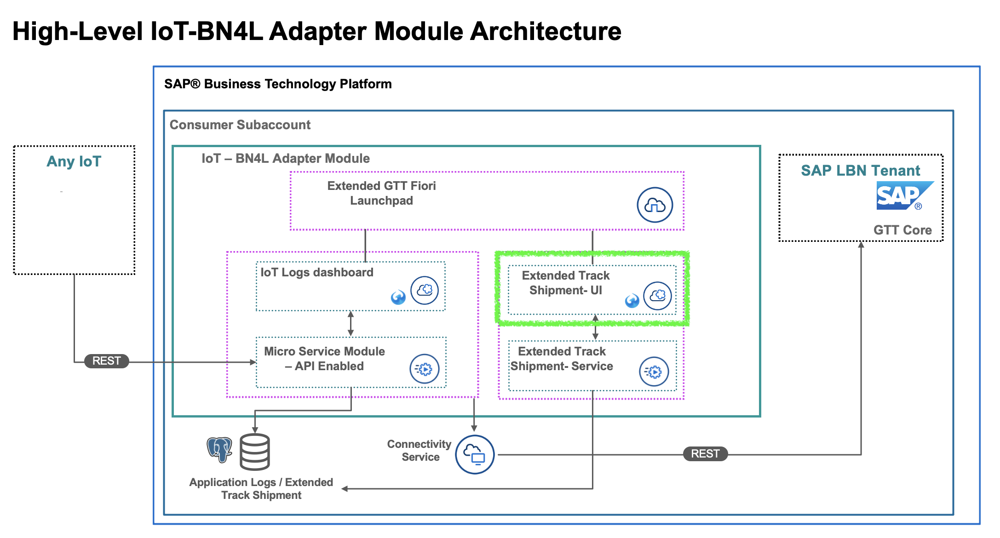
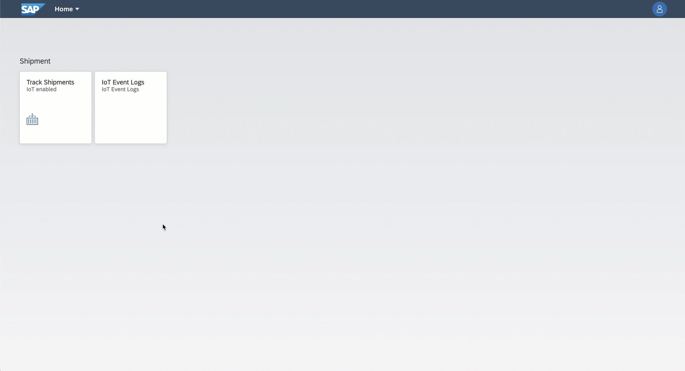

# GTT-V2-Sample-TrackShipments-UI

sample app - track shipments UI



## Pre-requisites

- Node.js - https://nodejs.org/

### Node.js

Make sure the Node.js is installed succesfully.

```sh
$ node -v
$ npm -v
```

## Run Locally

### SAPUI5 Application

Run web application in a local web server.

```sh
cd ui
npm start
```

Run unit test in a local browser
```sh
cd ui
npm run test:debug
```

You can visit http://localhost:5000/test/flpSandboxMockServer.html in the browser.

## How to deploy

```sh
cf login -a {API Endpoint} -u {Email address} --sso
```
Login to the Cloud Foundry environment on BTP. Open the link {API Endpoint/password} and get passcode.

```sh
cd GTT-V2-TrackShipmetExtended-UI
mbt build
```
This will build the application and generate a deployable *.mtar file.

```sh
cf deploy mta_archives/gtt-v2-ui-iot-track-shipments_2.4.0.mtar
```
This will deploy the application to the platform. You will still need to deploy the FLP to launch the application.


## How to Extend

### Pre-requisites
Change the TENANT_NAME in ui/.env file

Add a new filed into detail page IoT Fields content.
1. Open ui/webapp/view/fragment/ShipmentIoTInfo.fragment.xml
2. Copy any tag <smartForm:GroupElement>……</smartForm:GroupElement> and paste it in parallel
3. Change the label and text path to what you set.
4. Save file and deploy the app.

Add a new section into detail page.
1. Write a new fragment file with reference to ui/webapp/view/fragment/ShipmentIoTInfo.fragment.xml and put it into ui/webapp/view/fragment.
2. open ui/webapp/view/Shipment.view.xml page
3. copy any tag <ObjectPageSection>……</ObjectPageSection> and paste it in parallel
4. change the id to be unique.
5. change viewName to the path where you put the fragment file
6. You can use javascript to call backend service and set model in ui/webapp/controller/ShipmentIoTInfo.controller.js

## Result


