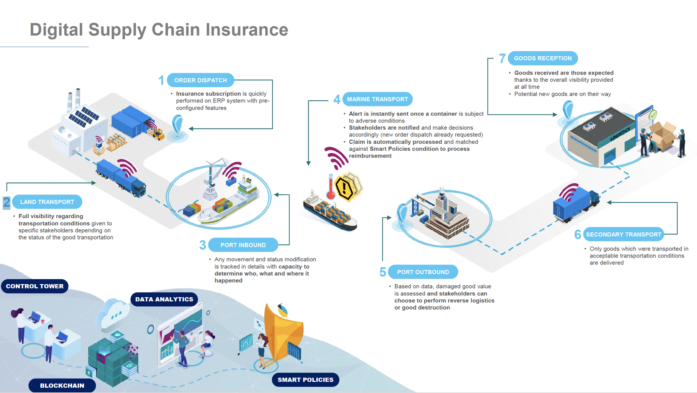
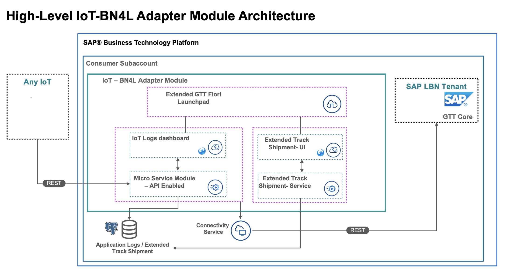

# SAP IoT Rapid Connect - Business Network for Logistics - Global Track & Trace

## Use case

Global value chains are becoming increasingly complex due to rising geopolitical risk, trade growth, and volatility of material availability. Losses due to poor transportation conditions have become a multibillion-dollar problem due to extreme difficulty in identifying the cause of damage or when an incident occurred. These challenges offer a great opportunity to overhaul the overall value chain with a solution that can provide real-time information on transport operations – from changes in temperature and humidity to whether the goods have been tilted – to all parties involved, giving everyone the ability to quickly adapt to potential incidents and rapidly recover from them.

The [Connected Product solution](https://news.sap.com/sea/2022/07/ntt-data-and-sap-announce-co-innovation-solution-to-track-fragile-and-sensitive-cargo-shipments-and-facilitate-insurance-procedures/) responds to this need by monitoring the location and environmental conditions of goods in transit.

## About this project

*IoT Rapid Connect is an open source adapter supporting integration with IOT platforms on hyperscalers. The adapter provides a framework that exposes REST based interfaces to communicate events determined by an IOT platform and the adapter transforms and delegates the events to Business Network for Logistics - Global Track & Trace component.*

### Project components

| Component | Description |
| --- | --- |
| GTT-V2-Extended-FLP | Provides the Fiori launchpad based on portal service and application router to access the applications. |
| GTT-V2-IoT-TrackShipments-Core-Service | Standard service template application delivered by GTT. No changes made in this project. |
| GTT-V2-IoT-ShipmentIotLogs-Service | Micro-service that provides the IOT Event API as well as backing services for the IOT Logs application. |
| GTT-V2-IoT-ShipmentIotLogs-UI | Provides the UI application for IOT Logs. |
| GTT-V2-IoT-TrackShipmentExtended-Service | Micro-service that provides APIs for extended shipment fields on the UI. |
| GTT-V2-IoT-TrackShipmentExtended-UI | Extended Track Shipment application to show additional/custom fields against the Shipment. |

## Requirements and Setup

*In order to use the adapter, the following are a pre-requisites*
 - [SAP Business Network for Logistics-Global Track & Trace](https://www.sap.com/products/business-network/global-track-and-trace.html)
    - [How to get a free Data Contributor tenant](https://github.com/SAP-samples/logistics-business-network-integration)
 - [SAP Business Technology Platform](https://www.sap.com/products/technology-platform.html)
 - Any IOT platform
 - Install [mbt tools](https://sap.github.io/cloud-mta-build-tool/download/).
 - Install [CF CLI](https://help.sap.com/docs/HANA_CLOUD_DATABASE/c2b99f19e9264c4d9ae9221b22f6f589/1307bc5dbb844146b0cf4594b39fc3db.html).
 - [Create a sub-account and space on Business Technology platform](https://help.sap.com/docs/BTP/65de2977205c403bbc107264b8eccf4b/c4c25cc63ac845779f76202360f98694.html?locale=en-US).

## Support, Feedback, Contributing

This project is open to feature requests/suggestions, bug reports etc. via [GitHub issues](https://github.com/SAP/<your-project>/issues). Contribution and feedback are encouraged and always welcome. For more information about how to contribute, the project structure, as well as additional contribution information, see our [Contribution Guidelines](CONTRIBUTING.md).

## Code of Conduct

We as members, contributors, and leaders pledge to make participation in our community a harassment-free experience for everyone. By participating in this project, you agree to abide by its [Code of Conduct](CODE_OF_CONDUCT.md) at all times.

## Licensing

Copyright 2022 SAP SE or an SAP affiliate company and [IoT Rapid Connect](https://github.com/SAP/iot-rapid-connect) contributors. Please see our [LICENSE](LICENSE) for copyright and license information. Detailed information including third-party components and their licensing/copyright information is available [via the REUSE tool](https://api.reuse.software/info/github.com/SAP/iot-rapid-connect).
